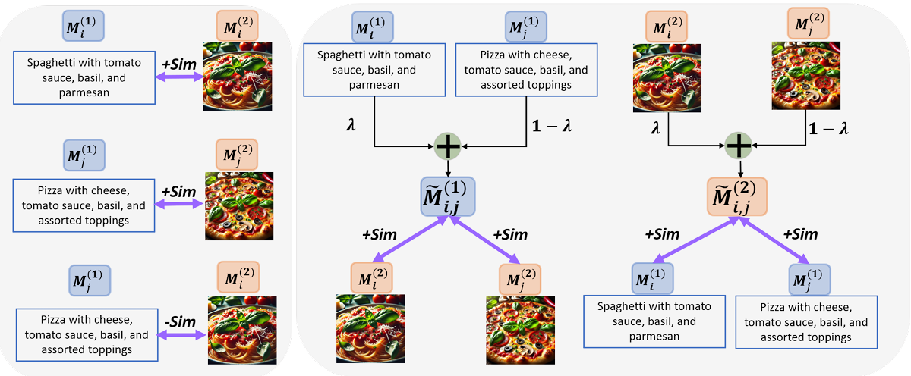

# M3CoL: Harnessing Shared Relations via Multimodal Mixup Contrastive Learning for Multimodal Classification
Code for the paper [M3CoL: Harnessing Shared Relations via Multimodal Mixup Contrastive Learning for Multimodal Classification](https://arxiv.org/abs/2409.17777). Accepted at TMLR.

## Introduction
Deep multimodal learning has shown remarkable success by leveraging contrastive learning to capture explicit one-to-one relations across modalities. However, real world data often exhibits shared relations beyond simple pairwise associations. We propose M3CoL, a Multimodal Mixup Contrastive Learning approach to capture nuanced *shared* relations inherent in multimodal data. Our key contribution is a Mixup-based contrastive loss that learns robust representations by aligning mixed samples from one modality with their corresponding samples from other modalities thereby capturing shared relations between them. For multimodal classification tasks, we introduce a framework that integrates a fusion module with unimodal prediction modules for auxiliary supervision during training, complemented by our proposed Mixup-based contrastive loss. Through extensive experiments on diverse datasets (N24News, ROSMAP, BRCA, and Food-101), we demonstrate that M3CoL effectively captures shared multimodal relations and generalizes across domains. It outperforms state-of-the-art methods on N24News, ROSMAP, and BRCA, while achieving comparable performance on Food-101.



Comparison of traditional contrastive and our proposed M3Co loss. *__M<sup>1</sup><sub>i</sub>__* and *__M<sup>2</sup><sub>i</sub>__* denote representations of the *i*-th sample from modalities 1 and 2, respectively. Traditional contrastive loss (left panel) aligns corresponding sample representations across modalities. M3Co (right panel) mixes the *i*-th and *j*-th samples from modality 1 and enforces the representations of this mixture to align with the representations of the corresponding *i*-th and *j*-th samples from modality 2, and vice versa. For the text modality, we mix the text embeddings, while we mix the raw inputs for other modalities. Similarity (Sim) represents type of alignment enforced between the embeddings for all modalities.

## Environment
We recommend running the python scripts inside a conda environment. Use the following commands to create a suitable requirement and download the needed libraries:
```
conda create -n mmc-m3co python=3.8
conda install pytorch==1.8.0 torchvision==0.9.0 torchaudio==0.8.0 cudatoolkit=11.1 -c pytorch -c conda-forge
pip install -r requirements.txt
```

## Data Preparation
[UPMC-Food-101](https://visiir.isir.upmc.fr/explore) is a multimodal food classification dataset. We adopt the most commonly used split method and remove those image-text pairs with missing images or text. The final dataset split is available [here](https://drive.google.com/drive/folders/11U1pjjQ5z6NaG9Gojo6QrSbIqEMYft7m?usp=share_link).

[N24News](https://github.com/billywzh717/n24news) is a multimodal news classification dataset. We adopt the original split method.

ROSMAP, BRCA can be downloaded from this [link](https://github.com/txWang/MOGONET/).

Add the datasets to a suitable directory, and use this directory path for training.

## Training

The following commands need to run to train the models (change the text_type and text_encoder for various text types and encoders):

N24News:
```
train_image_text.py --dataset=n24news --multi_mixup --text_encoder=roberta_base --text_type=caption --data_dir=/your/data/directory/path
```

Food101:
```
train_image_text.py --dataset=Food101 --multi_mixup --text_encoder=bert_base --data_dir=/your/data/directory/path
```

ROSMAP:
```
train_medical --dataset=rosmap --data_dir=/your/data/directory/path
```

BRCA:
```
train_medical --dataset=brca --data_dir=/your/data/directory/path
```

## Citation

If you use our work for your research, please cite our paper:

```
@misc{kumar2024harnessingsharedrelationsmultimodal,
      title={Harnessing Shared Relations via Multimodal Mixup Contrastive Learning for Multimodal Classification}, 
      author={Raja Kumar and Raghav Singhal and Pranamya Kulkarni and Deval Mehta and Kshitij Jadhav},
      year={2024},
      eprint={2409.17777},
      archivePrefix={arXiv},
      primaryClass={cs.CV},
      url={https://arxiv.org/abs/2409.17777}, 
}
```
